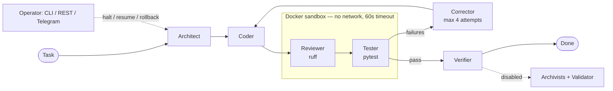

# Orchestral Machine ("Stanok")

A deterministic, restart-safe multi-agent coding system built on LangGraph. Cooperating LLM agents — Architect, Coder, Reviewer, Tester, Corrector, Verifier — take a software task and autonomously design, implement, lint, test, and fix a solution inside an isolated Docker sandbox, under strict structural contracts and operator control.

This is an experimental prototype, not a product. The core loop works end-to-end; some ambitious subsystems were designed but never finished, and this README says plainly which is which.

## Why it's interesting

- **Explicit state-machine orchestration** — a LangGraph `StateGraph` with 17 routing functions, loop counters, and a hard recursion limit (50). Every transition is deterministic and inspectable; nothing is left to "the LLM will figure it out."
- **Real execution, not simulation** — generated code is written into an ephemeral Docker container (`orchestral-worker`, network disabled, 60-second timeouts) where real `ruff` and real `pytest` run. Verdicts come from tool output, not model self-assessment.
- **Strict output contracts** — 27 Pydantic schemas; every agent response is parsed with balanced-brace JSON extraction and validated before it can touch the state.
- **Constitutional guardrails** — an `@enforce_constitutional_rules` decorator on the state boundary blocks any node from writing fields outside its role's permission matrix (e.g., a Coder cannot mark its own work approved).
- **Restart safety** — SHA-256-validated state checkpoints with rollback; a crashed run resumes from the last valid checkpoint.
- **Operator control plane** — halt/resume/reset/status via CLI, FastAPI REST endpoints, and a Telegram bot.
- **180 passing unit tests** across routing, constitutional enforcement, sandbox lifecycle, and streaming.

## Status

### Working

- LangGraph orchestration: Architect → Coder → Reviewer → Tester → Corrector → Verifier, with a self-correction loop (up to 4 targeted fix attempts before escalating to a human).
- LLM execution via the OpenRouter API, with per-role model mapping.
- Docker sandbox isolation (network disabled, workspace bind-mount, 60s timeouts).
- `ruff` linting and `pytest` execution inside the sandbox, parsed into structured verdicts.
- Pydantic output contracts and constitutional role-permission enforcement.
- SHA-256 checkpointing with validation and rollback.
- Operator CLI (`control_cli.py`), REST API (`python main.py serve`), and Telegram bot.
- AST-based project indexer (`src/tools/indexer.py`) that generates a symbol index to compress codebase context for prompts.

### Partial / fragile

- The Reviewer runs `ruff` unconditionally, so review is only meaningful for Python targets; a language-agnostic refactor was planned but not done.

### Designed but not working

- **Vector memory (Qdrant)** — `qdrant-client` is in `requirements.txt` but is never imported or connected. The archivist nodes prompt the LLM to emit record IDs that look real and write local JSON files instead. No long-term memory actually exists.
- **Archival pipeline** — disabled (`ARCHIVAL_ENABLED = False` in `src/config.py`) since v0.5.7, after the Archivist and Validator nodes fell into an infinite mutual-rejection loop ("Validator Doom Loop") that was never resolved.
- **MECHANIC self-improvement node** — exists only as a design RFC; `src/nodes/mechanic.py` was never created.
- **Brahma fleet orchestrator** (multi-container fleet dispatch, auto branch merging) — brainstorm document only; zero implementation.

## Architecture



Every node call goes through the constitutional enforcement boundary, and state is checkpointed (SHA-256) between transitions.

## Components

| Component | What it does | Status |
|---|---|---|
| `src/graph.py`, `src/routing.py` | State-machine controller, 17 routing functions | ✅ working |
| `src/nodes/` (architect, coder, reviewer, tester, corrector, verifier) | Agent roles executing via OpenRouter | ✅ working |
| `src/sandbox.py`, `Dockerfile` | Ephemeral Docker execution, network-disabled | ✅ working |
| `src/schemas.py`, `src/llm_factory.py` | 27 Pydantic contracts, robust JSON extraction | ✅ working |
| `src/enforcement.py`, `src/access_control.py` | Role permission matrix on state writes | ✅ working |
| `src/checkpoint.py` | SHA-256 checkpoints, resume, rollback | ✅ working |
| `control_cli.py`, `src/api/`, `src/integrations/` | Operator CLI / REST / Telegram | ✅ working |
| `src/tools/indexer.py` | AST symbol indexer (context compression) | ✅ working |
| `src/nodes/reviewer.py` | Python-only review (`ruff` hardcoded) | ⚠️ partial |
| `src/nodes/archivist_a1.py`, `archivist_a2.py`, `validator.py` | Archival + vector memory | ❌ disabled / simulated |
| MECHANIC (self-improvement), Brahma (fleet) | Design docs only | ❌ not implemented |

## Quick start

Requires Python 3.12+, Docker, and an [OpenRouter](https://openrouter.ai/) API key.

```bash
pip install -r requirements.txt

# Build the sandbox worker image
docker build -t orchestral-worker:latest .

# Configure secrets (OPENROUTER_API_KEY is the only required one)
cp .env.example .env

# Run a task through the agent loop
python main.py run --task "Write a function that parses ISO-8601 durations, with tests"

# Or start the REST control server
python main.py serve
```

Run the test suite (no API key or Docker needed — sandbox and LLM calls are mocked):

```bash
pytest
```

Note: `project_index.json` is auto-generated (`python3 -m src.tools.indexer`) and intentionally not committed.

## Project structure

```
├── main.py               # Entry point: run tasks, serve REST API, run Telegram bot
├── control_cli.py        # Operator CLI: halt / resume / force-reset / checkpoints
├── Dockerfile            # Sandbox worker image (python:3.12-slim + pytest + ruff)
├── src/
│   ├── graph.py          # LangGraph state-machine controller
│   ├── routing.py        # 17 routing functions between nodes
│   ├── schemas.py        # 27 Pydantic output contracts
│   ├── sandbox.py        # Docker container lifecycle
│   ├── enforcement.py    # Constitutional role-permission boundary
│   ├── checkpoint.py     # SHA-256 checkpointing & rollback
│   ├── llm_factory.py    # OpenRouter client + JSON extraction
│   ├── nodes/            # Agent implementations
│   ├── api/              # FastAPI control endpoints
│   ├── integrations/     # Telegram bot & listener
│   └── tools/            # AST project indexer, log viewer
└── tests/                # 180 unit tests + manual verification scripts
```

## Retrospective

This was my first serious agent system, and I over-scoped it. I trusted an LLM-suggested architecture and planned a large multi-agent system before proving the core loop worked — I confused a detailed plan with a realistic one. The parts that survived are the ones grounded in real feedback: the sandbox, the contracts, the enforcement boundary. The parts that didn't — vector memory, self-improvement, the fleet orchestrator — were designed on paper and never earned their place. Today I start with the narrowest vertical slice that tests the riskiest assumption, wire real services on day one, and treat LLM-generated plans as brainstorming, not verified estimates.

## License

[MIT](LICENSE)
